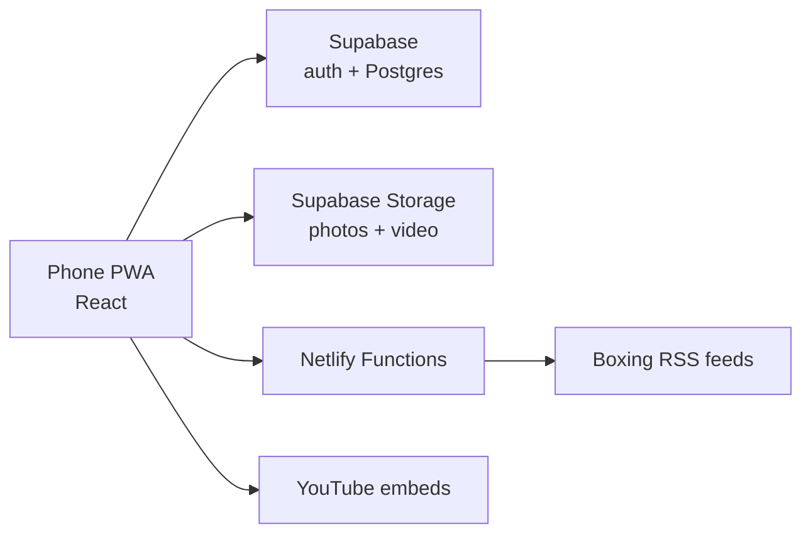

# COLD BLOOD — Boxer's App Spec

Sep 24, 2026 · @Larry

## Overview

COLD BLOOD is a phone-first app that runs a professional boxer's entire life: training, fight camp, weight, nutrition, career, contacts, learning, news, and a mindset/manifestation section. It is built first for one real user, a 19-year-old pro heavyweight, then sold to other fighters.

**Primary user:** a pro or serious amateur boxer who opens the app several times a day, usually one-handed, often tired, sometimes with wraps on. Every common action (log a weigh-in, log a session, start a meditation) must take under 10 seconds.

**Secondary users (phase 3):** the fighter's trainer or manager, with read-only access the fighter grants.

**Goals**

1. Replace the notes app, paper logs, and scattered bookmarks a fighter uses today.
2. Keep the fighter aware of the next fight, the camp plan, and his weight at all times.
3. Give him a daily mindset routine built on The Master Key System, visualization, and a dream board.
4. Be clean enough to sell as a subscription after the first user validates it.

**Design direction:** dark theme by default, high contrast, large tap targets, bold condensed headings. Black, off-white, and one accent color (bright blood red, to match the COLD BLOOD name). Bottom tab bar: Home, Train, Fuel, Mind, More.

## Tech stack and architecture

Build an installable Progressive Web App (PWA) deployed on Netlify from a GitHub repo, with Supabase as the backend. This avoids app store fees and review until the product is proven.

| Layer | Choice | Why |
| --- | --- | --- |
| Frontend | React + Vite + TypeScript | Fast, well supported by Claude Code |
| Styling | Tailwind CSS | Quick, consistent dark UI |
| PWA | vite-plugin-pwa | Installs to home screen, works offline |
| Auth + database | Supabase (Postgres, row-level security) | Free tier, accounts, per-user data isolation |
| File storage | Supabase Storage | Dream board photos/videos, fight footage |
| Server functions | Netlify Functions | News RSS fetching, anything needing secrets |
| Charts | Recharts | Weight and training trends |
| Notifications | Web Push (phase 2) | Weigh-in, meditation, and schedule reminders |



The app talks to Supabase directly for user data; Netlify Functions only handle outside calls (news feeds) so the browser never hits CORS problems.

**Rules for Claude Code**

- Row-level security on every table: a user can only read and write rows where `user_id = auth.uid()`.
- All secrets in Netlify and Supabase environment variables, never in the repo.
- Offline-first for logs: queue weigh-ins and sessions locally and sync when back online.
- Mobile layout first; desktop is just a centered phone-width column.

## Data model

Every user-owned table has `id` (uuid), `user_id` (fk to auth.users), `created_at`, and `updated_at`. Only the extra fields are listed.

| Table | Key fields |
| --- | --- |
| profiles | fighter\_name, nickname, weight\_class, stance, height\_cm, reach\_cm, gym, record\_w, record\_l, record\_d, record\_ko, units (lb/kg) |
| fights | date, opponent, venue, city, commission, weigh\_in\_at, contract\_weight, rounds, purse, status (upcoming/won/lost/draw/NC), method, round\_ended, notes |
| camps | fight\_id, start\_date, template (8/10/12 wk), phase notes |
| events | title, type (training/sparring/weigh-in/medical/media/travel/other), start\_at, end\_at, location, camp\_id, reminder\_min |
| training\_sessions | date, type (roadwork/bag/pads/mitts/sparring/S&C/technique/recovery), duration\_min, rounds, rpe\_1\_10, notes, video\_url |
| sparring\_rounds | session\_id, partner, rounds, what\_worked, what\_didnt, damage\_taken (none/light/moderate/heavy) |
| roadwork | date, distance, duration, avg\_pace, route\_notes |
| wellness | date, sleep\_hours, resting\_hr, soreness\_1\_5, energy\_1\_5, mood\_1\_5 |
| injuries | area, description, date\_start, date\_cleared, status, provider |
| weigh\_ins | taken\_at, weight, time\_of\_day, notes |
| meals | eaten\_at, name, calories, protein\_g, carbs\_g, fat\_g, photo\_url |
| water | date, amount |
| nutrition\_targets | calories, protein\_g, carbs\_g, fat\_g, water\_target |
| licenses | type (commission license/physical/bloodwork/eye exam/MRI/other), issuer, issued, expires, file\_url |
| finances | date, kind (income/expense), category (purse/sponsor/gym/travel/medical/gear/coach/other), amount, fight\_id, notes |
| contacts | name, role (trainer/manager/promoter/cutman/matchmaker/commission/sparring/physio/nutritionist/media/other), phone, email, company, city, notes, favorite |
| videos | title, url, source, skill\_tag, level, is\_curated (global), user\_saved |
| lessons | title, category, body\_md, order (global content) |
| mk\_progress | current\_part (1-24), part\_started\_at, notes per part |
| dream\_items | media\_url, media\_type (photo/video), caption, goal\_category, position\_x, position\_y, order |
| goals | title, category (career/financial/physical/personal), target\_date, status, why |
| affirmations | text, active, order |
| journal\_entries | date, gratitude, intention, reflection |
| mind\_sessions | date, type (meditation/visualization/MK exercise), duration\_min, routine\_id |
| routines | name, steps (json), schedule |

Global content tables (`videos` where is\_curated, `lessons`, Master Key text) are readable by all users and writable only by an admin role.

## Feature modules

Nine modules cover the boxing side; the Mind tab is specified in the next section.

### 1. Home dashboard

- Big countdown to the next fight (days, and "fight week" mode inside 7 days).
- Today's events from the schedule.
- Current weight vs. contract or walk-around target, with a 14-day trend sparkline.
- Quick-log buttons: Weigh-in, Session, Meal, Water, Wellness check.
- Streaks: training days, meditation days, Master Key days.
- Today's affirmation and one dream board image.

### 2. Fight camp and schedule

- Calendar with day, week, and list views; color by event type.
- Create a camp from a fight: pick 8, 10, or 12 weeks and the app generates the phases (base, build, peak, taper, fight week) counting back from fight night, with editable default events.
- Recurring events (roadwork every morning, sparring Tue/Thu/Sat).
- Reminders before each event.
- Fight week checklist: medicals submitted, gear packed, travel confirmed, weigh-in time and location, cutman confirmed.

### 3. Training log

- Log a session in three taps: type, duration, rounds, effort (RPE 1-10), notes.
- Sparring detail: partner, rounds, what worked, what didn't, damage taken; attach a video link.
- Roadwork: distance, time, pace (manual entry; GPS is out of scope).
- Built-in round timer: configurable rounds, round length, rest, warning bell at 10 seconds, loud and screen-awake.
- Workout library: saved templates (bag routine, S&C day) the fighter can start and check off.
- Wellness check: sleep, resting heart rate, soreness, energy, mood; flag when soreness is high 3 days running.
- Injury tracker with status and clearance date.
- Weekly summary: sessions, total rounds, sparring rounds, roadwork miles, average RPE.

### 4. Weight and nutrition

- Weigh-in log with chart (7, 30, 90 days, full camp).
- Target line: contract weight or walk-around target; show distance to target and daily rate of change.
- Meal log with calories and macros; optional photo; saved meals for one-tap repeats.
- Water tracker with daily target.
- Daily targets set by the user (the app does not prescribe diets).
- Fight week view: weigh-in countdown, weight trend, rehydration and refuel notes the fighter writes with his team.
- Show a clear note that weight cutting should be supervised by his coach and a medical professional.

### 5. Video library

- Curated free YouTube videos embedded in-app (no downloading or re-hosting).
- Browse by skill: stance and footwork, jab, power punches, combinations, defense, head movement, counterpunching, clinch and inside work, ring generalship, conditioning, heavyweight fighters, film breakdowns.
- Filter by level (fundamental, intermediate, advanced).
- Save, mark watched, add personal notes per video.
- "My footage" folder: the fighter's own sparring and fight clips (upload to storage or paste a link).
- Admin screen to add curated videos by pasting a YouTube URL; title and thumbnail pulled from YouTube's oEmbed endpoint.

### 6. Boxing IQ (lessons)

Short written lessons (Markdown, 2-5 minute reads) seeded by the admin. Starter categories:

- Ring craft: controlling distance, cutting off the ring, fighting southpaws, fighting taller or shorter opponents.
- Fight week and fight night: weigh-in day, warm-up timing, working with the corner between rounds.
- Recovery: sleep, deloads, concussion awareness and when to stop sparring.
- Business of boxing: manager vs. promoter roles, reading a bout agreement, purse splits and typical percentages, sanctioning fees, building a record, sponsorships, social media.
- Commission basics: licensing, required medicals, what happens at a weigh-in.

Each lesson ends with a "This isn't legal or medical advice" line where relevant.

### 7. News

- Feed of latest boxing headlines from several public RSS feeds, fetched by a Netlify Function every 30 minutes and cached.
- Show headline, source, time, and thumbnail; tap opens the original article in the browser (never copy full articles into the app).
- Filter by source and by keyword (e.g., "heavyweight").
- Claude Code should verify each RSS URL works before adding it and keep the list in one config file.

### 8. Career and business

- Fight record: every bout with result, method, round, opponent, venue; auto-calculated W-L-D and KO totals.
- Upcoming fights with contract details.
- Licenses and medicals with expiration dates and alerts 30 and 7 days before.
- Money: income and expenses by category and by fight; yearly totals for taxes; export to CSV.
- Document vault: upload contracts, licenses, and medical results as PDFs or photos (private storage bucket).

### 9. Contact book

- Contacts tagged by boxing role; favorites pinned at top.
- One-tap call, text, and email.
- Search and filter by role.
- Link contacts to fights (promoter, matchmaker, cutman for that bout).
- Import from phone contacts is out of scope for the PWA; manual entry plus vCard import.

## Mind tab: manifestation and mental training

The Mind tab is a daily mental routine built on Charles F. Haanel's The Master Key System (1916, public domain in the US), plus a dream board, visualization, meditation, goals, affirmations, and a journal.

### 1. Master Key System course

- Full text of all 24 parts stored in the app as Markdown, one part per week, as Haanel intended.
- Source: a public-domain edition (for example Project Gutenberg or Internet Archive). Claude Code must confirm the edition is public domain and clean up OCR errors; do not use modern annotated editions.
- Course screen shows the current part, days into the week, and that week's exercise pulled out as a checklist.
- Daily MK session timer for the part's sitting/concentration exercise (default 15 minutes, adjustable), logged to `mind_sessions`.
- Notes per part; progress bar 1-24; option to restart or jump to a part.
- Reader settings: font size, dark/sepia, and text-to-speech using the browser's built-in speech so he can listen during roadwork or recovery.

### 2. Dream board

- Upload photos and short videos (max 50 MB each) from the phone to a private storage bucket.
- Free-form board: drag, resize, and arrange items; or switch to grid view.
- Caption and goal category per item (belt, house, family, car, money, physique).
- Full-screen slideshow mode with optional background audio, meant for 2-5 minutes of viewing each morning and night.
- Multiple boards allowed (e.g., "Career" and "Life").

### 3. Visualization

Guided scripts shown as timed, step-by-step screens, with optional text-to-speech narration:

- Fight night walkthrough: locker room, wraps, walkout, ring intro, first bell, executing the game plan, handling getting hit or cut, staying composed, the finish, the announcement.
- Perfect training day: sharp in sparring, strong on roadwork, disciplined meals.
- Future self: living the championship life in detail, drawn from his dream board.
- Adversity rehearsal: knockdown, bad round, controversial decision; calm response each time.
- Custom scripts: he can write and save his own.

### 4. Meditation and breathwork

- Timer with start and end bells, interval bells, and silent mode.
- Breathing patterns with an animated guide: box breathing (4-4-4-4), 4-7-8 for sleep, and slow nasal breathing for pre-fight calm.
- Short sessions labeled by use: pre-sparring focus, pre-fight nerves, post-training recovery, sleep.

### 5. Goals, affirmations, and journal

- Goals with category, target date, status, and a "why it matters" field; link goals to dream board items.
- Affirmations list; one rotates on the dashboard daily; option to read all of them in a morning routine.
- Daily journal: gratitude, today's intention, evening reflection; searchable history.

### 6. Routines

- Build morning and night routines from blocks (e.g., Morning: affirmations, 5-min breathwork, MK exercise, dream board slideshow, intention).
- Default morning and night routines ship pre-built and editable.
- One "Start routine" button runs each block in sequence.
- Reminders at set times; streak tracking.

## Build phases and instructions for Claude Code

Build in three phases; Roman uses phase 1 daily before anything in phase 2 starts.

| Phase | Scope | Done when |
| --- | --- | --- |
| 1. Core daily use | Auth, profile, dashboard, weigh-ins + chart, training log, round timer, schedule, contacts, Master Key reader + progress, affirmations, journal | Roman logs weight and training daily for 2 weeks without friction |
| 2. Full product | Fight camp generator, nutrition, wellness, injuries, video library, lessons, news, dream board, visualization, meditation, routines, career/money, document vault, push reminders | Every module in this spec works on his phone |
| 3. Sellable | Landing page, Stripe subscriptions, onboarding, trainer/manager read-only sharing, CSV export, admin content tools, privacy policy and terms | First paying user outside the family |

### Prompt to paste into Claude Code

```markdown
Read SPEC.md in this repo. It is the full product spec for COLD BLOOD, a PWA for professional boxers.

1. Scaffold React + Vite + TypeScript + Tailwind + vite-plugin-pwa, deployable to Netlify.
2. Set up Supabase: write SQL migrations for every table in the Data model section, with row-level security so users only see their own rows.
3. Build Phase 1 only. Stop after each module, run it, and tell me what to test on my phone.
4. Use a dark theme, large tap targets, and a bottom tab bar: Home, Train, Fuel, Mind, More.
5. Keep all secrets in environment variables and tell me exactly which values to set in Netlify and Supabase.
6. Ask me before adding any paid service.
```

**How to use this doc:** export it as Markdown, save it as `SPEC.md` in the root of a new GitHub repo, open the repo in Claude Code, and paste the prompt above.

### Open questions

- [ ] App name for sale: keep COLD BLOOD, or use a general name and make COLD BLOOD Roman's profile?
- [ ] Units default: pounds (US) with a kg toggle?
- [ ] Does Roman's trainer want access in phase 1 or later?
- [ ] Subscription price for other fighters (decide in phase 3).
